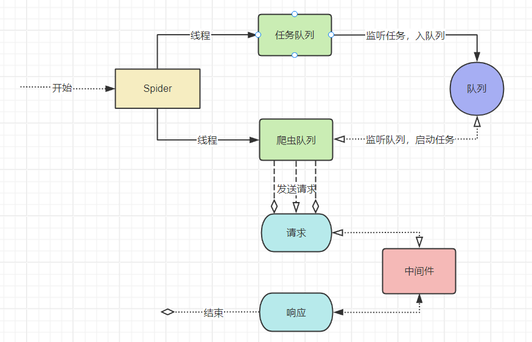

[GitHub](https://github.com/peng0928/PrSpiders)

## 开始

### 介绍

1. PrSpiders 是一个多线程爬虫，依赖稳定的 requests 爬虫模块，极大的提高了采集速度，拥有耦合性，后续会拓展更多稳定功能。

### 安装

```python
pip install PrSpiders
国内镜像:
pip install PrSpiders -i https://pypi.tuna.tsinghua.edu.cn/simple
```

### 架构流程图



### **Demo**

```python
from PrSpider import PrSpiders

class Spider(PrSpiders):

    start_urls = 'https://www.runoob.com'

    def parse(self, response):
        # print(response.text)
        print(response, response.code, response.url)

  #<Response Code=200 Len=323273> 200 https://www.runoob.com/

if __name__ == '__main__':

    Spider()
```

### **重写入口函数-start_requests**

> start_requests 是框架的启动入口，PrSpiders.Requests 是发送请求的发送，参数下面会列举。

```python
from PrSpider import PrSpiders


class Spider(PrSpiders):

    def start_requests(self, **kwargs):
        start_urls = 'https://www.runoob.com'
        PrSpiders.Requests(url=start_urls, callback=self.parse)

    def parse(self, response):
        # print(response.text)
        print(response, response.code, response.url)


if __name__ == '__main__':

    Spider()
```

**3.PrSpiders 基本配置**

> 底层使用 ThreadPoolExecutor

    workers: 线程池
    retry: 是否开启请求失败重试，默认开启
    download_delay: 请求周期，默认0s
    download_num: 每次线程请求数量，默认1秒5个请求
    logger: 日志保存本地，默认False，开启Ture OR str（文件名），如 logger='test'
    log_level: 日志等级,默认Info,等级(debug, info, warn, error)
    log_stdout: 日志存储是否重定向，默认关闭

> 使用方法如下

```python
from PrSpider import PrSpiders


class Spider(PrSpiders):

  retry = False
  download_delay = 3
  download_num = 10

  def start_requests(self, **kwargs):
        start_urls = ['https://www.runoob.com' for i in range(100)]
        PrSpiders.Requests(url=start_urls, callback=self.parse)

  def parse(self, response):
        # print(response.text)
        print(response, response.code, response.url)


if __name__ == '__main__':

    Spider()
```

## 配置

### PrSpiders 默认参数

```设置
thread_num: Optional[int] = 10  # 线程数
request_num: Optional[int] = 0  # 请求数
retry_num: Optional[int] = 0  # 重试数
success_num: Optional[int] = 0  # 成功请求数
false_num: Optional[int] = 0  # 失败请求数
start_urls: Optional[list] = None  # 默认请求起始url
retry: Optional[bool] = True  # 重试开关，默认开启
retry_xpath: Optional[str] = None  # 重试开关，默认开启
download_delay: Optional[int] = 0  # 请求下载周期 默认0s
download_num: Optional[int] = 5  # 请求下载数量 默认5/次
logger: Optional[bool or str] = False  # 日志存储开关，默认关闭：可选（bool|文件名）
log_level: Optional[str] = 'info'  # 日志等级，默认info
log_stdout: Optional[bool] = False  # 日志控制台重定向，默认关闭
custom_settings: Optional[dict] = {}  # 通用设置
session: Optional[bool] = True  # 请求是否开启session;默认开启
traceback: Optional[bool] = False  # 当程序发生异常时，是否显示堆栈;默认关闭
log_format: Optional[str] = log_format  # 日志格式 文件utils.log_format
pipelines: Optional[dict] = None  # 管道(工作目录)
```

```不建议设置
work_dir: Optional[str] = os.getcwd()# 工作目录
executor: Optional[object] = object# 线程池处理器
pid: Optional[int] = os.getppid()# 程序进程id
start_time: Optional[int] = time.time()# 开始时间
futures: Optional[list] = set()# 线程池对象
Queues: Optional[object] = PriorityQueue()# 优先级队列
init: Optional[int] = 0# 日志初始化
deep_func: Optional[list] = []# 深度函数
Request: Optional[object] = object# 请求对象
schedule_time: Optional[float] = 0.314# 调度时间

```

### PrSpiders.Requests 请求对象

| 参数                   | 介绍         | 默认值      |
| ---------------------- | ------------ | ----------- |
| url                    | 请求网址     | Str or List |
| callback               | 回调函数     | Object      |
| headers                | 请求头       | Dict        |
| retry_time             | 重试次数     | 3(Int)      |
| method                 | 请求方式     | Get(Str)    |
| meta                   | 回调参数传递 | {} (Dict)   |
| encoding               | 编码格式     | utf-8(Str)  |
| retry_interval         | 重试间隔     | 3 (Int)     |
| timeout                | 请求超时时间 | 30 (Int)    |
| data or params or json | 请求参数     | Str or Dict |

**继承 requests 的参数**

| 参数            | 介绍                        | 默认值 |
| --------------- | --------------------------- | ------ |
| cookies         | 字典 或 CookieJar 对象      |        |
| files           | 文件上传                    |        |
| auth            | 用户认证                    |        |
| allow_redirects | True 表示允许跟踪           |        |
| proxies         | 代理                        |        |
| verify          | True 时将会验证 SSL 证书    |        |
| stream          | False，将会立即下载响应内容 |        |
| cert            |                             |        |

```python
   PrSpiders.Requests(url=start_urls, headers={}, method='post', encoding='gbk', callback=self.parse,  retry_time=10, retry_interval=0.5, meta={'hhh': 'ggg'})
```

## Api

**GET Status Code**

    response.code

**GET Text**

    response.text

**GET Content**

    response.content

**GET Url**

    response.url

**GET History**

    response.history

**GET Headers**

    response.headers

**GET Text Length**

    response.len

**GET Lxml Xpath**

    response.xpath

## Xpath Api

1.  text()方法:将 xpath 结果转成 text
2.  date()方法:将 xpath 结果转成 date
3.  get()方法:将 xpath 结果提取
4.  getall()方法:将 xpath 结果全部提取，拥有 text()方法和 date()方法

```python
from PrSpider import PrSpiders


class Spider(PrSpiders):
    log_level = 'info'

    def start_requests(self, **kwargs):
        start_urls = "https://blog.csdn.net/nav/python"
        PrSpiders.Requests(url=start_urls, callback=self.parse)

    def parse(self, response):
        lisqueryall = response.xpath("//div[@class='content']").getall()
        for query in lisqueryall:
            title = query.xpath(".//span[@class='blog-text']").text(lists=True)
            lishref = query.xpath(".//a[@class='blog']/@href").get()
            print({
                '写法': '第一种',
                '列表标题': title,
                '列表链接': lishref
            })
        title = response.xpath("//span[@class='blog-text']").text()
        lisquery = response.xpath("//div[@class='content']/a[@class='blog']/@href").get()
        print({
            '写法': '第二种',
            '列表标题': title,
            '列表链接': lisquery
        })
        PrSpiders.Requests(url=lisquery, callback=self.cparse)

    def cparse(self, response):
        title = response.xpath("//h1[@id='articleContentId']").text()
        pudate = response.xpath("//span[@class='time']").date()
        content = response.xpath("//div[@id='content_views']").text()
        print({
            '标题': title,
            '时间': str(pudate),
            'href': response.url,
        })


if __name__ == "__main__":
    Spider()

```

## 常见问题

### 遇到问题,请提到 issues
