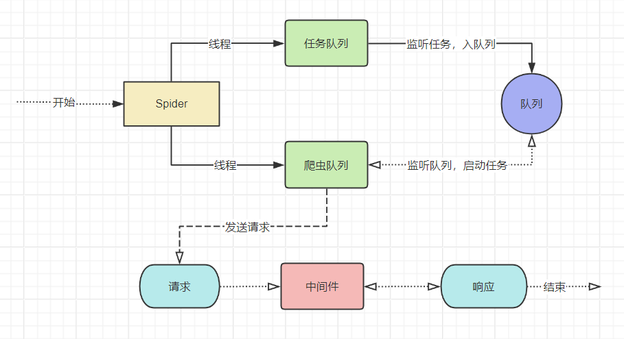

## _开始_

### 介绍

1. PrSpiders 是一个多线程爬虫，依赖稳定的 requests 爬虫模块，极大的提高了采集速度，拥有耦合性，后续会拓展更多稳定功能。

### _安装_

```python
pip install PrSpiders
国内镜像:
pip install PrSpiders -i https://pypi.tuna.tsinghua.edu.cn/simple
```

### 架构流程图



### **Demo**

```python
from PrSpider import PrSpiders

class Spider(PrSpiders):

    start_urls = 'https://www.runoob.com'

    def parse(self, response):
        # print(response.text)
        print(response, response.code, response.url)

  #<Response Code=200 Len=323273> 200 https://www.runoob.com/

if __name__ == '__main__':

    Spider()
```

### **重写入口函数-start_requests**

> start_requests 是框架的启动入口，PrSpiders.Requests 是发送请求的发送，参数下面会列举。

```python
from PrSpider import PrSpiders


class Spider(PrSpiders):

    def start_requests(self, **kwargs):
        start_urls = 'https://www.runoob.com'
        PrSpiders.Requests(url=start_urls, callback=self.parse)

    def parse(self, response):
        # print(response.text)
        print(response, response.code, response.url)


if __name__ == '__main__':

    Spider()
```

**3.PrSpiders 基本配置**

> 底层使用 ThreadPoolExecutor

    workers: 线程池
    retry: 是否开启请求失败重试，默认开启
    download_delay: 请求周期，默认0s
    download_num: 每次线程请求数量，默认1秒5个请求
    logger: 日志保存本地，默认False，开启Ture OR str（文件名），如 logger='test'
    log_level: 日志等级,默认Info,等级(debug, info, warn, error)
    log_stdout: 日志存储是否重定向，默认关闭

> 使用方法如下

```python
from PrSpider import PrSpiders


class Spider(PrSpiders):

  retry = False
  download_delay = 3
  download_num = 10

  def start_requests(self, **kwargs):
        start_urls = ['https://www.runoob.com' for i in range(100)]
        PrSpiders.Requests(url=start_urls, callback=self.parse)

  def parse(self, response):
        # print(response.text)
        print(response, response.code, response.url)


if __name__ == '__main__':

    Spider()
```

**4.PrSpiders.Requests 基本配置**

> 基本参数：
> url：请求网址
> callback：回调函数
> headers：请求头
> retry_time：请求失败重试次数
> method：请求方式（默认 Get 方法），
> meta：回调参数传递
> encoding：编码格式（默认 utf-8）
> retry_interval：重试间隔
> timeout：请求超时时间（默认 10s）
> data or params: 请求参数
> \*\*kwargs：继承 requests 的参数如（data, params, proxies）

```python
   PrSpiders.Requests(url=start_urls, headers={}, method='post', encoding='gbk', callback=self.parse,  retry_time=10, retry_interval=0.5, meta={'hhh': 'ggg'})
```

## _Api_

**GET Status Code**

    response.code

**GET Text**

    response.text

**GET Content**

    response.content

**GET Url**

    response.url

**GET History**

    response.history

**GET Headers**

    response.headers

**GET Text Length**

    response.len

**GET Lxml Xpath**

    response.xpath

## _Xpath Api_

1.  text()方法:将 xpath 结果转成 text
2.  date()方法:将 xpath 结果转成 date
3.  get()方法:将 xpath 结果提取
4.  getall()方法:将 xpath 结果全部提取，拥有 text()方法和 date()方法

```python
from PrSpider import PrSpiders


class Spider(PrSpiders):
    log_level = 'info'

    def start_requests(self, **kwargs):
        start_urls = "https://blog.csdn.net/nav/python"
        PrSpiders.Requests(url=start_urls, callback=self.parse)

    def parse(self, response):
        lisqueryall = response.xpath("//div[@class='content']").getall()
        for query in lisqueryall:
            title = query.xpath(".//span[@class='blog-text']").text(lists=True)
            lishref = query.xpath(".//a[@class='blog']/@href").get()
            print({
                '写法': '第一种',
                '列表标题': title,
                '列表链接': lishref
            })
        title = response.xpath("//span[@class='blog-text']").text()
        lisquery = response.xpath("//div[@class='content']/a[@class='blog']/@href").get()
        print({
            '写法': '第二种',
            '列表标题': title,
            '列表链接': lisquery
        })
        PrSpiders.Requests(url=lisquery, callback=self.cparse)

    def cparse(self, response):
        title = response.xpath("//h1[@id='articleContentId']").text()
        pudate = response.xpath("//span[@class='time']").date()
        content = response.xpath("//div[@id='content_views']").text()
        print({
            '标题': title,
            '时间': str(pudate),
            'href': response.url,
        })


if __name__ == "__main__":
    Spider()

```

## 常见问题

### 遇到问题,请提到 issues
